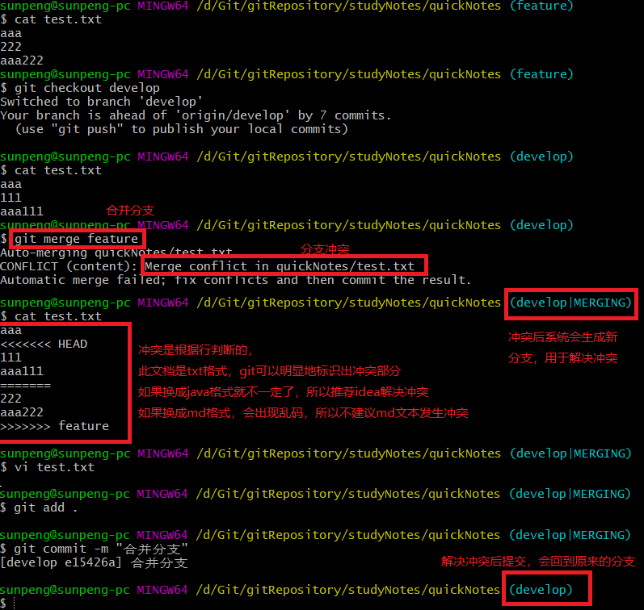
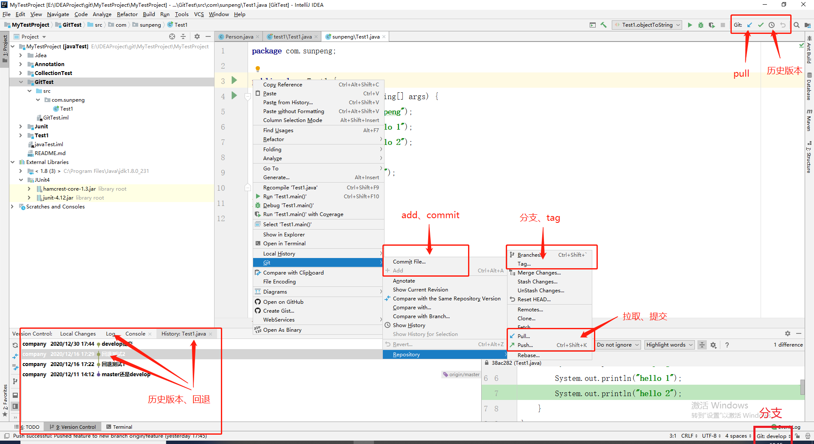

# git

### 1.git常用命令

#### 1.1 提交

git add filename      把git工作区的改动添加到暂存区

git commit -m "xxx" 把暂存区代码提交到本地分支，注意“xxx”是修改的备注，git要求必填

git push          把本地分支的代码推送到此分支绑定的远程分支上

git pull origin BranceName 把远程分支代码拉取到本地，远程分支名称要加origin 

git status         查看当前操作的状态信息

git log           查看代码修改日志

#### 1.2 回退(需谨慎操作)

工作区回退：git checkout -- filenanme  暂存区代码覆盖工作区

暂存区回退：git reset HERD       把暂存区的内容全部撤销

本地仓库回退：git reset –hard commitId  让HEAD指针指向以前的一个版本

远程仓库回退：git push -f        强制推送

HEAD指针：本地仓库每个分支上的代码的修改都会生成一个commit id信息，HEAD指针指向最近一次的commit提交，通过commit id可以进行版本回退。查看HEAD指针的改动日志为git reflog

#### 1.3 分支操作

查看分支: git branch            加-r查看远程分支

新建分支：git branch (origin) BranceName   加origin表示远程分支

切换分支：git checkout (origin) BranceName  加origin表示远程分支

删除分支：git branch -d BranceName     -D是强制删除

追踪远程：git branch -u origin BranceName  

创建切换追踪分支：git checkout -b 本地名 origin/远程名 

查看远程和本地的追踪关系：git branch -vv  一般远程和本地同名，不过远程要加origin

合并分支：git merge BranceName

 

### 2. github使用和上传

github是远程代码托管仓库，任意人都可以查看clone，但要修改就需要权限，公司的是私密的，因为是购买的。github和git bash的连接如下：

#### 2.1 生辰公钥：

ssh-keygen -t rsa -C "邮箱账号"，生成公钥的保存在id_rsa.pub文件上；

#### 2.2 开通权限：

github登录 -> setting -> SSH and GPG keys -> new SSH key ->粘贴公钥。

#### 2.3 git clone

克隆代码，后面就可以查看、修改和更改代码了。其作用有三：

（1）把指定的远程仓库代码拉取到本地

（2）自动创建远程仓库名称origin

（3）自动生成本仓库，本地生成一个默认的主干分支master，追踪远程的主干分支

 

### 3.gitflow研发流程


#### 3.0 创建仓库 master

​    项目开始，在github中创建仓库，主分支。

#### 3.1 创建开发分支develop

创建develop分支，master分支存储了正式发布的历史，而develop分支保存功能的集成历史。
git branch develop             创建develop分支
git push -u origin develop    本地develop push到服务器，-u表示远端没有则创建之
git clone                                                           

#### 3.2 创建功能分支 feature

常见功能分支feature，这才是研发这开发代码的地方。
git checkout -b feature-1 develop    # 本地创建功能分支（基于develop分支）

#### 3.3创建小功能分支 feature/v1

   若feature过大，则再拆分之。
git checkout -b feature/v1 develop    # 基于develop分支创建feature/v1分支
git push -u origin feature/v1         # 将feature/v1分支提交到远端

#### 3.4 开发完成 push

开发者需要Pull Request请求，审核通过后，管理员merge与push。
git merge –no-ff feature-1            # develop分支合并功能分支
git push                          # 推送本地develop分支到服务器

#### 3.5准备发布 release

创建release分支用于测试和修复，为了不影响后面的开发。
git checkout -b release-0.1 develop    # 从develop分支创建release-0.1分支并发布

#### 3.6 完成发布

测试和修复完成后将release 分支merge到master分支和develop分支。
git checkout master                     # 本地切换到master分支
git merge --no-ff release-0.1           # master分支合并release-0.1分支
git push                                # 推送master分支到服务器
git checkout develop                    # 本地切换到develop分支
git merge –-no-ff release-0.1           # develop分支合并release-0.1分支
git push                                # 推送develop分支到服务器
git branch -d release-0.1               # 删除release-0.1分支
git tag -a 0.1 -m "Initial public release" master   # 本地master分支上打0.1版本的tag
git push --tags                           # 推送到远端服务器

#### 3.7 发布后bug hotfix

开发后的bug在hotfix上调试，为了不影响后面的开发。
git checkout -b hotfix-issue-#001 master  在master分支上创建一个hotfix分支用来解决bug

#### 3.8总结

（1）master  develop  feature  feature/v1将项目逐步细分，可以让项目条例层次清晰，权限控制强力，版本跟新稳定。
（2）release和hotfix用于开发完成的调试和发布后的调试，它们不会阻塞后面的开发。


### 2020.12.30

##### 1.commit

当又文件修改时，在什么分支上commit则算这个分支的版本 ，而非在哪个分支上修改

##### 2.查询分支

dea对于未追踪远程分支的本地分支，会在远程自动创建相应的分支，并追踪

```sh
git branch
#-a  查看所有远程
#-v  查看本地分支
#-vv 查看本地分支追踪的远程分支
```

##### 3.冲突



##### 4.idea集成git



遗留：

1.出现冲突，不予解决会怎么样，develop|merging 会作为一个新的分支一直存在吗，git branch查询分支

2.新建的仓库如何退到远程


### 2020.12.30

#### 1.  git

- git config --global user.name "sunpengHome"

- git config --global user.email "476567162@qq.com"

- git init

- git add

- git commit

- git status

- git log

- git log --oneline

- git reflog

- git reset --hard 版本的索引号/HEAD

  --mixed 回退本地仓库和暂存区

  --soft 仅回退本地仓库

- git reset --hard 

- git  diff  无/版本索引/head  filename ：比较暂存区的其它文件的目录

  - 无比较的本地与暂存区

- 

hard：重(zhong)（操作）

reset ：重置


