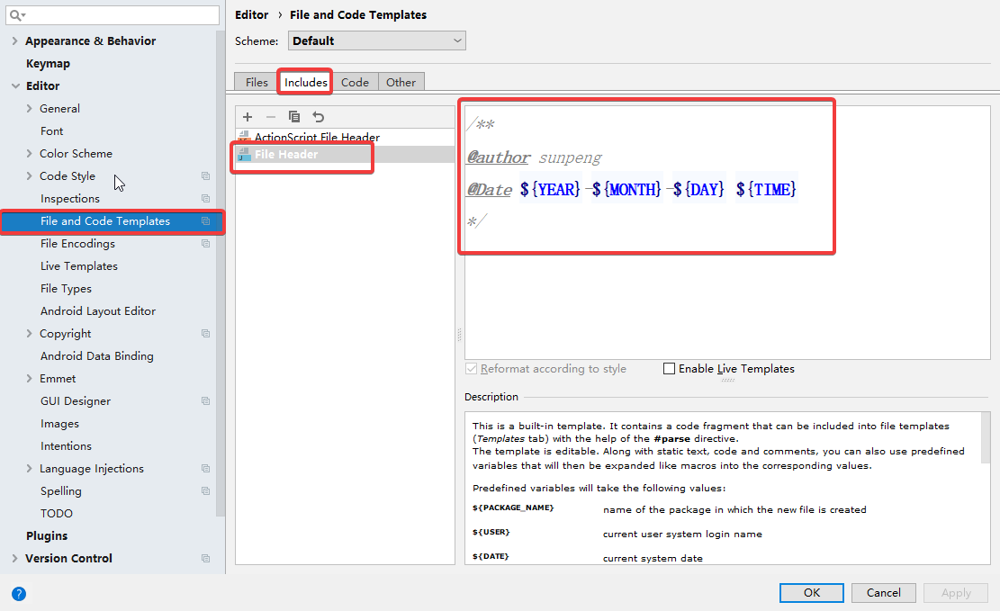

# 遗留：

- 多态实现工厂模式，代码练习

- 内部类实现lambad表达式，原理和C++比较

- object.hashCode(); 原理和使用

  


# 一、java开篇

### 1. java核心

java核心：不同于C++的地方

- 垃圾处理机制
- 跨平台性

### 2. java跨平台性

- 过程

  .java

  编译：javac.exe -》 JDK编译

  .class

  执行：java.exe  -》JVM解释.class文件，JVM针对不同系统对.class进行不同的解释

- 总结：
  - 一次编译，到处执行
  - javac.exe和java.exe文件都在JVM，java.exe会调用JVM
  - “可执行文件”在命令行中就是“命令”。

### 3. C语言跨平台性

C语言在多个操作系统执行的方式

- window：VS，所以VS是微软的

- Linux：gcc/g++，需要编写makfefile文件


### 4. 终端命令

| linux    | win/doc命令                                           |
| -------- | ----------------------------------------------------- |
| 无       | 切换盘符，直接输入盘符，如：D:  d:  C:  c:            |
| cd       | C:/User 不能直接进入 D:/git，必须切换盘符，再切换目录 |
| ls       | dir                                                   |
| clear    | cls                                                   |
| mkdir    | md                                                    |
| rm -r    | rd                                                    |
| 复制文件 | copy                                                  |
| rm       | del                                                   |


### 5. 一个文件中多个类

- 一个源文件中可以有多个类，只能有一个类被public修饰，源文件的名字必须跟public修饰的那个类名保持一致。
- 多个类会产生独立的字节码文件，即一个 .java 产生多个 .class


### 6. 进入要编译文件所在的目录的终端

- 方法1：文件路径上输入 cmd 
- 方法2：在notepad中右键文件 --》打开文件夹所在命令行


### 7. 配置环境变量

- path：配置JVM中可执行文件的路径 -》D:\Java\jdk1.8.0_131\bin

  D:\Java\jdk1.8.0_131\jre\bin -》 配置jre中可执行文件，可以不配置，目前还不知道用在哪里

- classpath：配置字节码文件（.class）的位置，可配可不配

- JAVA_HOME：D:\Java\jdk1.8.0_131

  解决tomcat在执行startup.bat的时候会出现闪退问题

### 8. 字节码文件

- 打开是16进制数字，需要专业的文件打开
- 反编译软件，资料中有

### 9. 转义字符：\t

- \t：制表符，每8位一个格子，不足则补全，eg

### 10. JDK、JRE、JVM

- JRE作用：JDK里的工具（如javac）几乎是用Java所编写，同属于Java应用程序，因此要使用JDK所附的工具来开发Java程序，所以自身需要附一套JRE才能运行。
- 安装了两个JRE：系统会先到 JDK 的子级目录找，然后到同级目录找，也就是说另外安装的JER没用
- JVM+Lib=JRE：JVM无法单独进行翻译，需要类库lib


# 二、javaSE基础

### 1、数组

#### 1.1 java与C++的区别

| 数组   | C++                                   | java                                              |
| ------ | ------------------------------------- | ------------------------------------------------- |
| 定义   | 内置，本质是一个不能改变指向的指针    | 对象，对C中数组封装而来                           |
| 初始化 | int  arr[] = {1,2,3};                 | int[] arr = {1,2,3} == new int{1,2,3};  本质是new |
| 赋值   | arr1 = arr2; 错误，数组名不能改变指向 | arr1 = arr2; 可以，java可以随便指                 |
| 多维数 | 每一维的长度必须一样                  | 每一维的长度可以不一样                            |

#### 1.2 初始化

初始化:

静态初始化：int[] arr=new int[]{1,2,3,4}   化简为 int[] arr={1,2,3,4}   

动态初始化：int[] arr=new int[5]; 整形的系统默认值为0，浮点为0.0，字符是'\0'，引用类型为NULL

```java
int[]  ar = new ar[num];
int[][]  arr=new  arr[numI][];
int[][][] arrr =new arrr[numI]numJ[][];
/*
上述的定义初始化都是合法的，以arr为例子，只需要给出第一维的大小就可以定义，让编译器知道在堆上开辟几个int[]即可，其他维可以后面再初始化，但要修改具体元素时全部维度都必须定义完成。
*/
```

#### 1.3 Arrays

```java
//工具Arrays：扩展数组的功能，里面全是静态函数
int[] arr = {1,2,3};
Arrays.tostring(arr)               //配合打印使用
Arrays.sort(arr)                   //排序
Arrays.binarySearch(arr,value)     //输出pos
Arrays.copyOf(arr,length)          //完整复制
Arrays.copyOfRange(arr, left, right)  //区间复制，左闭右开
Arrays.equals(arr,arr2)               //判断数组内的值相等不，补足==
Arrays.fill(arr,value)                //数组全部填充为value
    
//系统复制(源，源的起始位置， 目标数组， 目标数组的起始位置， 需要复制的长度)；
System.arraycopy(src, srcsPos,  des, desPos, length);
```


### 2、String

```java
//new对象
String str1 = "hello";
String str3 = new String("hello");  
char[] c = {'h','e','l','l','o'};
String str5 = new String(c);
String str6 = new String(c,0,2);

//改变指向
s = "hello2"; //改变执行
s += "world"; //内在是改变了指向，外在表现是尾增

//增删查改，内存不可变，无法增删
s += "world"; //外在表现是尾增，内在是改变了指向
s.replace('value1','value2'); //改：把String元素中的1替换成2
s.chatAt(pos) //查：根据位置查值
s.indesOf(values) //查：根据值查询位置，没有返回-1
	
//判断相等
equalsIgnoreCase() //通过内容且忽视大小写
//字符串分割: split
String s = "hello world sun peng";
String[] strs = s.split(" ");
	
//可变字符串StringBuffer
s.append("")  //增
s.insert(pos, 任意类型值)   //插入
delete(leftPos, rightPos) //删：从left删到right,左闭右开
```

### 3、IO

#### 3.1 Scanner

```java
import java.util.Scanner;      
Scanner sc = new Scanner(System.in);
int age = sc.nextInt();   //整形
String name = sc.next();  //字符串
char sex = sc.next().charAt(0); //字符型
```

- 与C++一样，space和enter都表示结束
- UTF8编码：字符占俩个字节，有汉字编码，'\0'是字符第0个

#### 3.2 file

打开关闭

```java
File f = new File("sp1.txt");
boolean  f.exists() //判断是否打开成功
boolean  f.delete() //删除
boolean  f.isDirectory() //判断是否是目录文件/文件夹
boolean  f.isFile()  //判断是否是文件
```

读写

| IO                                                       | 读写                                                         | 备注                                                         |
| -------------------------------------------------------- | ------------------------------------------------------------ | ------------------------------------------------------------ |
| FileReader  in = new FileReader("file");                 | int  read(); int是读到的数  int  read(char[] buffer) int是读到的个数   -1表示没读到 | int  read(); 返回值是int类型，表示读到的数。  但是reader还是按照char大小读，  inputStream还是按照byte大小读。 |
| FileWriter  out = new FileWriter("file");                | int  write(int c);    int  write(char[] buffer)  int  write(string buffer) |                                                              |
| BufferedReader  br = new BufferedReader(FileReader in);  | int  read();  int read(char[] buffer)   string readline();   | int  read();同理                                             |
| BufferedWriter  bw = new BufferedWriter(FileWriter out); | int  write(int c);    int  write(char[] buffer)  int  write(string buffer) | bw.newLine()  bw.flush()                                     |

FilterInputStream\ FilterOutputStream \BufferedInputStream\BufferedOutputStream按照Byte读取


### 4、集合

#### 4.1 结构

- Collection    

  - set

    **HashSet** 两者之间

  - list

    - **LinkedList** 改快读慢

    - **ArrayList** 读快改慢

  - Vector

  - **Stack**

  - Queue

    - **LinkedList**

- Map

  - **HashMap**

  - **TreeMap**

#### 4.2 增删查改

| 操作 | set                                      | list                                             | Map                                                          | Stack(Stack是实现类) | Queue(Queue是接口，实现类是LinkendList)                      |
| ---- | ---------------------------------------- | ------------------------------------------------ | ------------------------------------------------------------ | -------------------- | ------------------------------------------------------------ |
| 增   | boolean add(E e)                         | boolean  add(E e)  void  add(int index, E e)     | Object  put(Object key, Object value)  如果key已存在，则返回被替换掉的元素  void  putAll(Map t); | E  push(E item);     | boolean  add(E e);  **boolean offer(E e);**队列为空返回null  在队头插入 |
| 删   | boolean  remove(Object o)  void  clear() | boolean  remove(Object o)  void  clear()         | Object  remove(Object key);  void  clear()                   | E  pop();            | E remove();   **E poll();** 队列为空返回null  获取并删除队头 |
| 查   | boolean  contains(Object o)              | E  get(int index)  boolean  contains(Object o)   | Object  get(Object key);  boolean  containsKey(Object key);  boolean  containsValue(Object value); | E  peek();           | E  element();  **E peek()**; 队列为空返回null  获取但不移除队头 |
| 改   |                                          | E  set(int index, E element)  返回被替换掉的元素 | Object  put(Object key, Object value)  如果key已存在，则返回被替换掉的元素 |                      |                                                              |
| 判空 | boolean  isEmpty()                       | boolean  isEmpty()                               | boolean  isEmpty()                                           | boolean  empty()     | boolean  isEmpty()                                           |
| 大小 | int  size();                             | int  size();                                     | int  size();                                                 |                      |                                                              |

#### 4.3 遍历Iterator

```java
public void fun1(Collection c) {
    Iterator i = c.iterator();       //1、定义迭代器，初始位置为-1
    while (i.hasNext()){          //2.（p+1） == null 判断有没有下一个
    if(i.next().equals("aaa")){   //3.p++并返回*p，先++指向下一个，然后在解引用
        i.remove();             //4.删除
      }
    }                          //总结：核心原因是初始为-1，如此循环的思想就是需要的时候再给
}
```

- 当程序中有两个i.next()时,会有两次++，程序每一循环都是+2，后一个就和前一个不一样，后一个也需要先判断是否越界，i.hasNext()，所以只是为了*p的使用，那么先要给出Object o = i.next(); 然后就可以反复使用o，而不用担心多次++

#### 4.4 常用算法Collections  

Collections中的算法只对List实现，因为List是有序的数据结构，且都是静态方法。


# 三、idea

### 1、设置

- 修改类头的文档注释信息

  

  ```java
  /**
  @author sunpeng
  @date ${YEAR}-${MONTH}-${DAY} ${TIME}
  */
  ```

- 

### 2、快捷键

注意：不起作用，可能是和输入法的快捷键重复

- 搜索
  - 搜索当前文件：alt + f
  - 搜索全部文件：alt + F
- 替换
  - 替换当前文件：alt + r
  - 替换全部文件：alt + R
- 光标到行首/尾：Home / End
- 上下移动代码：ctrl+shift+上/下
- alt+数字(小键盘不可用)：显示左侧菜单，如：alt+7显示代码结构，alt+1显示工程
- 实现/覆写
  - ctrl + o: 覆写方法
  - ctrl + i：实现接口中的方法
- 其他
  - ctrl + shift + u：大小写转换
  - ctr + z/Z：回退/取消撤销

- 查看子类：ctrl + h


### 3、调试

#### 3.1 断点调试


```java
@ControllerAdvice
public class MyExceptionHandler {

    @ExceptionHandler(value =Exception.class)
	public String exceptionHandler(Exception e){
		System.out.println("发生了一个异常"+e);
       	return e.getMessage();
    }
}

@ControllerAdvice
public class GlobalExceptionHandler {

    /**
     * 处理自定义异常
     *
     */
    @ExceptionHandler(value = DefinitionException.class)
    @ResponseBody
    public Result bizExceptionHandler(DefinitionException e) {
        return Result.defineError(e);
    }

    /**
     * 处理其他异常
     *
     */
    @ExceptionHandler(value = Exception.class)
    @ResponseBody
    public Result exceptionHandler( Exception e) {
        return Result.otherError(ErrorEnum.INTERNAL_SERVER_ERROR);
    }
}
```

#### 3.2 计算：alt+F8

作用：在调试模式下，计算选中部分的结果（参数在中必须内存）。


# 四、面向对象

**类的组成：属性，方法，构造器，代码块，内部类**

### 1. java和C++的区别

| 特性             | java                                                         | C++                                          |
| ---------------- | ------------------------------------------------------------ | -------------------------------------------- |
| 构造器重写       | 重写会使得默认无参构造器失效，需重新提供                     | 与系统的无参构造形成重载                     |
| 对象所占用内存   | People p1 = new People(); (变量再栈内容在堆)                 | People p1; (栈)   People *p1 = new People(); |
| this             | 1.构造器调用构造器；2.解决字段和构造器形参重名，详2.4        | 一般缺省，因为显式无加强用法                 |
| 继承关键字       | extends                                                      | :                                            |
| 继承权限         | public                                                       | public、private、protected                   |
| 多重继承         | 不支持，但接口中实现了此功能                                 | 支持，且可能会有菱形继承                     |
| 构造器的继承     | 缺省为 super();                                              | 缺省合法，也可以使用初始化列表               |
| 派生类中访问基类 | 关键字：super                                                | 使用作用域 -》类名::                         |
| 多态             | Base b = new Derive();                                       | Base  *p = new Derive();                     |
| 抽象函数         | 一般将覆盖关系的基类成员方法都声明为抽象类                   | 纯虚函数                                     |
| 抽象类           | 关键字：abstract，仅仅为了继承用，本省就不需要也无法构造对象了，详见3.3 | 抽象类                                       |
| 接口             |                                                              | 无                                           |


### 2.  面向对象基本内容

#### 2.1 格式

- 属性：静态描述类的特征：权限修饰符 [特征修饰符] 数据类型 属性名字 [=值]

- 方法：静态描述类的行为：权限修饰符 [特征修饰符] 返回值类型 方法的名字（参数列表） 【抛出异常】 方法执行体

#### 2.2 构造器

- 格式：权限修饰符 与类名一样的方法名([参数列表]) 【抛出异常】 方法执行体

- 作用：用来创建当前类的对象

- 构造和写法：没有返回类型 有返回值

- 调用：通过new关键字

- 特点：每一个类都有默认无参数的构造方法，我们定义的和默认的构成了重载

#### 2.3 程序块(代码块)

- 可以理解是一个非常特殊的方法

- 没有修饰符 没有返回类型 没有名字 没有参数

- 只有一个方法的执行体{}

- 程序块是在每一次调用构造方法之前都默认执行

- 程序块没有重载，却存在多个，按照创建的顺序逐一运行

#### 2.4 this关键字的使用

- 指代词，代替的是调用属性/方法时的当前对象

- this既然时一个对象，可以调用一般的属性，可以调用一般的方法，放置在类成员的任何位置(四个成员都可以)

- this也可以调用构造器：this(); 但是此句只能放到第一行，不然就无法识别两个对象了？

- 用途：解决构造函数中属性和传参重名的问题，而C++中就没有解决这个。


### 3. 继承

#### 3.1 Base b = new Derive();

1. b有实无名，即"名"(类型)是基类，"实"(内存)是子类。
2. 那么如果子类的方法或字段中存在public，b能不能访问子类的变量呢？答案是不能，即使实际存在，不知道叫什么，自然也无法访问。
3. "有实"却无法访问，那有没有"实"又有什么用呢？答案覆盖（基类和子类的同函数名、同参数、兼容返回值的成员方法）和多态（表现为同一个入口却调用不同的方法）。
4. 编译时，对象在调用成员方法时，编译器会查看对象的内存，调用覆盖的子类方法，当然非覆盖方法它还是调用不了，就和（3）一样。
5. 如果子类中有一方法继承自基类，同时它还调用了非继承的方法，那么这是不是就间接钻篓了？答案是允许合法。
6. 通过（5）可以访问到非继承的，但还可以通过强制类型转换访问，如 ((Derive)b).方法。

#### 3.2 final

表示不允许被继承，默认/不写认为是可以继承

#### 3.3 abstract：

- 含义：抽象，基类中不需要实现的可以声明为抽象方法，类中只要有一个抽象方法，类就也需要加abstract，认为是抽象类，C++中叫纯虚函数和抽象类。

- 一般将覆盖关系的基类成员方法都声明为抽象类。

- 抽象类不能构造对象：Base()，它构造对象以经没有意义了，只是作为一个抽象的祖先概念，构造出的实体对象对现今而言没有意义。所以，一般它只用在多态中：Base b = Deriver()；


### 4.接口

- 构造器：接口没有构造器，不能定义对象，有些像式抽象类，没有全部实现抽象方法就是抽象类
- 一旦实现一个接口，那么实现类要实现接口的所有抽象方法。
- 访问接口中的常量
- 继承与实现
  - 继承：手机 extends 照相机 “is-a” 手机是一个照相机
  - 实现：手机 implements 拍摄功能“has-a” 手机具有拍摄功能
- 多态的应用场合：

  - 接口当作方法的形参，传入具体实现类的对象

  - 接口作为方法的返回值，返回的是具体实现类的对象
- 在JDK1.8之前，接口只有两部分内容
  - 常量：固定的修饰符：public static final
  - 抽象方法：固定修饰符：public abstract
  - 问：为什么JDK1.8之后接口中加入非抽象方法？ 答：因为如果修改接口，对实现接口的类们影响太大。


### 5.static

- static修饰变量
  - 在类加载的时候一起加载入方法区中的静态域中
  - 先于对象存在
  - 访问方式： 对象名.属性名    类名.属性名（推荐）

- static修饰方法
  - 静态方法不能访问非静态成员，因为静态式属于全局，不属于所在类中，所以没有this指针
  - 静态方法访问静态变量：类名.属性名（推荐），如果是类内可以直省略类名


### 6.代码块

代码块分类：普通块，构造块，静态块，同步块（多线程）

代码块执行顺序：

- 最先执行静态块，只在类加载的时候执行一次，所以一般以后实战写项目：创建工厂，数据库的初始化信息都放入静态块。
  一般用于执行一些**全局性的初始化操作**。

- 再执行构造块，（不常用）
- 再执行构造器，
- 再执行方法中的普通块。


### 7.Object

- toString()：idea可以直接生成

- equals(Object o)：idea可以直接生成，可用用到运算符 instanceof， if(a instanceof b)，判断a是否是b的实例化

  

### 8.内部类

内部类：成员内部类 (静态的，非静态的) 和  局部内部类（位置：方法内，块内，构造器内）

#### 8.1 局部内部类

- 作用：如果类B在整个项目中只使用一次，那么就没有必要单独创建一个B类，使用内部类就可以了
- 在局部内部类中访问到的变量必须是被final修饰的
- 局部内部类 -> 匿名内部类 -> lambad表达式

```java
public class TestOuter {
    //1.在局部内部类中访问到的变量必须是被final修饰的
    public void method(){
        final int num = 10;
        class A{
            public void a(){
                //num = 20;
                System.out.println(num);
            }
        }
    }
    //2.如果类B在整个项目中只使用一次，那么就没有必要单独创建一个B类，使用内部类就可以了
    public Comparable method2(){
        class B implements Comparable{
            @Override
            public int compareTo(Object o) {
                return 100;
            }
        }
        return new B();
    }
    public Comparable method3(){
        //3.匿名内部类
        return new Comparable(){
            @Override
            public int compareTo(Object o) {
                return 200;
            }
        };
    }
    public void teat(){
        Comparable com = new Comparable(){
            @Override
            public int compareTo(Object o) {
                return 200;
            }
        };
        System.out.println(com.compareTo("abc"));
    }
}
```

#### 8.2 实例：排序时compare自定义

##### 8.2.1 java

```java
public class Demo {
    //内部类
    public void SortTransClass(List<Person> persons) {
        Collections.sort(persons,new Comparator<Person>() {
            @Override
            public int compare(Person p1,Person p2) {
                if(p1.getAge() > p2.getAge()) return 1;
                else if (p1.getAge() == p2.getAge()) return 0;
                else return -1;
            }
        });
    }
    //lambda
    public void SortTransLambda(List<Person> persons) {
        Collections.sort(persons,(Person p1,Person p2) -> p1.getAge().compareTo(p2.getAge()));
    }
}
```

##### 8.2.2 C++

实现方式：函数指针、函数对象（原理是小括号运算符重载）、lambda表达式（原理未知？）

```c++
#include<vector>
#include<string>
#include<algorithm>
#include<numeric>
#include<iostream>
using namespace std;

//1.函数指针实现
bool Compare(int a, int b)
{
	return a<b;
}
//2.函数对象实现
class ClassCompare
{
public:
	bool operator()(int a, int b)
	{
		return a>b;
	}
};

//测试
void Test(int* arr, len){
 	sort(arr, len, Compare);                //1.函数指针
	sort(arr, len, ClassCompare());         //2.仿函数
	auto f = [](int a, int b){return a>b;};  //3.lambda	
	sort(arr, len, f);                       //[]中可以捕获多余的参数   
}

//补充：sort自己实现
template<typename T>
void sort(int *arr, int len, T &fun)
{
    int i, j;
    int tmp;
    int m = 0;
    for (i = 0; i < len; i++)
    {
        m = i;
        for (j = i + 1; j < len; j++)
        {
            if (fun(arr[j], arr[m]))  //3.fun(arr[j], arr[m])这里限制了可调用对象
            {                         //函数对象和函数指针的缺点
                tmp = arr[m];
                arr[m] = arr[j];
                arr[j] = tmp;
            }
        }
    }
}
```


### 9.类与类的关系

对于继承、实现这两种关系没多少疑问，它们体现的是一种类和类、或者类与接口间的纵向关系。其他的四种关系体现的是类和类、或者类与接口间的引用、横向关系，是比较难区分的，有很多事物间的关系要想准确定位是很难的。前面也提到，这四种关系都是**语义级别**的，所以从代码层面并不能完全区分各种关系，但总的来说，后几种关系所表现的强弱程度依次为：**组合>聚合>关联>依赖**


### 10、C++

#### 10.1 java与C++的区别

| 特性             | java                                                    | C++                                         |
| ---------------- | ------------------------------------------------------- | ------------------------------------------- |
| 对象的内存       | People p1 = new People(); 始终在堆中                    | 栈People p1;   堆People *p1 = new People(); |
| 继承关键字       | extends                                                 | :                                           |
| 继承权限         | public                                                  | public、private、protected                  |
| 多重继承         | 单继承、多实现                                          | 支持，且可能会有菱形继承                    |
| 派生类中访问基类 | 关键字：super                                           | 作用域：类名::                              |
| 构造器调用构造器 | 一般用this，继承中用super                               | 继承中用初始化列表                          |
| 多态             | Base b = new Derive(); （java没指针但估计也是指针实现） | Base  *p = new Derive();                    |

#### 10.2 C++多天实现

Base b = new Derive();

1. b有实无名，即"名"(类型)是基类，"实"(内存)是子类。
2. 那么如果子类的方法或字段中存在public，b能不能访问子类的变量呢？答案是不能，即使实际存在，不知道叫什么，自然也无法访问。
3. "有实"却无法访问，那有没有"实"又有什么用呢？答案覆盖（基类和子类的同函数名、同参数、兼容返回值的成员方法）和多态（表现为同一个入口却调用不同的方法）。
4. 编译时，对象在调用成员方法时，编译器会查看对象的内存，调用覆盖的子类方法，当然非覆盖方法它还是调用不了，就和（3）一样。
5. 如果子类中有一方法继承自基类，同时它还调用了非继承的方法，那么这是不是就间接钻篓了？答案是允许合法。
6. 通过（5）可以访问到非继承的，但还可以通过强制类型转换访问，如 ((Derive)b).方法。


# 五、javaSE进阶

### 1. 异常

#### 1.1 关键字

- try：捕获

- catch：处理

  - 处理方式

    ```java
    //1.什么都不做
    
    //2.为用户打印信息
    System.out.println("出现异常");
    
    //3.为程序员打印详细信息
    System.out.println(e);
    System.out.println(e.getMessage());
    e.printStackTrace();
    
    //4.抛出
    throw e;
    ```

  - 仍会导致中断
    - throw抛出异常的情况
    - catch中没有正常的进行异常捕获
    - 在try中遇到return
  - catah使用
    - try中出现异常以后，将异常类型跟catch后面的类型依次比较，按照代码的顺序进行比对，执行第一个与异常类型匹配的catch语句
    - 一旦执行其中一条catch语句之后，后面的catch语句就会被忽略了！
    - 在安排catch语句的顺序的时候，一般会将特殊异常放在前面（并列），一般化的异常放在后面。
      先写子类异常，再写父类异常。

  - 使用总结

    ```java
     try{
         //
     } catch (IllegalAccessException e){
         //1.什么都不做
         //2.为用户打印信息
         System.out.println("出现异常");
         //3.为程序员打印详细信息
         System.out.println(e);
         System.out.println(e.getMessage());
         e.printStackTrace(); //打印堆栈
         //4.抛出
         throw e;
     }catch (InstantiationException ie){
         //
     }finally {
         // 
     }
    ```

- throw：抛出

- throws：

- finally：一定执行

  - 用途：关闭数据库资源，关闭IO流资源，关闭socket资源。
  - 优先于return等
  - 只用 System.exit(0);//终止当前的虚拟机执行 会导致finally不执行

#### 1.2 throw和throws的区别

- 位置不同：
  throw：方法内部
  throws: 方法的签名处，方法的声明处

- 内容不同：
  throw+异常对象（检查异常，运行时异常）
  throws+异常的类型（可以多个类型，用，拼接）

- 作用不同：
  throw：异常出现的源头，制造异常。
  throws:在方法的声明处，告诉方法的调用者，这个方法中可能会出现我声明的这些异常。然后调用者对这个异常进行处理：
  要么自己处理要么再继续向外抛出异常

#### 1.3 分类

- object.Throwable
  - Error：JCM虚拟机错误
    - 栈溢出
  - Exception
    - 检查异常：可以预见的，系统会画横线提醒，必须要解决，一般通过try-catch解决
    - 运行时异常：RuntimeException：相反，一般就throw

#### 1.4 处理异常

- 检查异常：系统可以预见的，系统会画横线提醒，必须要解决
  - 因为可以预见所以必须解决，不解决启动不了
  - 一般用try-catch解决，因为知道异常类型，所以就地解决
  - 也可以用throw-throws，由于必须解决，所以会一层一层向上抛出。用途是抛到最后一起解决，但最后还是要try-catch，不然最后抛出main方法后，抛给虚拟机执行默认解决方法—printStackTrace()。
- 运行时异常：系统只有在运行后才知道，程序员难以完全预见的，不是必须解决的
  - 可以说都是未知异常
  - 一般用throw抛出，因为不是必须解决的，所以不用throws
  - 也可以使用try-catch解决，但实际中大部分运行场景都是无法预料的，所以难以使用

- 自定义异常：自定义异常不是第三类异常，它需要继承Exception或RuntimeException，为业务而生
  - 继承Exception：自定义异常都是可以遇见的，按理说继承Exception比较好，但这么做，系统会充斥这大量的try-catch，逻辑混乱且没有代码复用性。
  - 继承RuntimeException：只需要throw即可，但是自定义异常都是需要处理的，不然把它定义出来干什么。
  - 解决方法：自定义异常继承RuntimeException，自定义异常继承实现框架异常处理接口，如此实现了统一处理，并且此方法也会同时处理RuntimeException。


### 2. 常用类

#### 2.1 基础数据类型对象

| 源 src  | 目标 tag | 方法1                             | 方法2                     |
| ------- | -------- | --------------------------------- | ------------------------- |
| int     | Integer  | 自动包装                          |                           |
| Integer | int      | 自动解包 Integer tag= 100;        | tag =  src.intValue();    |
| int     | String   | String tag = 100;                 | String tag = 100+'0';     |
| String  | int      | tag = Integer.parseInt(src, pos); |                           |
| Integer | String   | tag = src.toString()              | tag = String.valueOf(src) |
| String  | Integer  | tag = Integer.valueOf(src);       |                           |

#### 2.2 date 

|              | Date                                                         | LocalData                                                    |
| ------------ | ------------------------------------------------------------ | ------------------------------------------------------------ |
| 创建         | Date date = new Date();                                      | LocalDateTime localDateTime = LocalDateTime.now();           |
| get          | 无                                                           | localDateTime.getYear();                                     |
| set          | 无                                                           | LocalDateTime newLocalDateTime = localDateTime.withMonth(8);原有的不改变，也不能改变，新创建出来的是改变后的 |
| DateFormat   | DateFormat df = new SimpleDateFormat("yyyy-MM-dd HH:mm:ss")； | DateTimeFormatter df = DateTimeFormatter.ofPattern("yyyy-MM-dd hh:mm:ss"); |
| stringToDate | Date d = df.parse("2019-4-6 12:23:54")                       | TemporalAccessor parse2 = df3.parse("2020-06-15 03:22:03");  |
| DateToString | String format = df.format(new Date());                       | String format = df3.format(LocalDateTime.now());             |
|              |                                                              |                                                              |

DateFormat df1 = new SimpleDateFormat("yyyy-MM-dd HH:mm:ss");

DateFormat df2 = new SimpleDateFormat("yyyy-MM-dd'T'HH:mm:ss");  //T必须带单引号

DateFormat df3 = new SimpleDateFormat("yyyy-MM-dd HH:mm:ss.SSS");  //毫秒

#### 2.3 math

math类属于java.lang，不用导入

```java
public class Test01 {
    //这是一个main方法，是程序的入口：
    public static void main(String[] args) {
        System.out.println("取大的那个值："+Math.max(3, 6));
        System.out.println("取小的那个值："+Math.min(3, 6));
    }
}
```

静态导入：静态方法可以直接调用，但是重名危险很大

```java
//静态导入：
import static java.lang.Math.*;
public class Test01 {
    public static void main(String[] args) {
        System.out.println("取大的那个值："+max(3, 6));
        System.out.println("取小的那个值："+min(3, 6));
    }
}
```

#### 2.4 随机数 Random

用无参构造器就行，不用种种子

```java
//（2）利用空参构造器创建对象：
Random r2 = new Random();//表面是在调用无参数构造器，实际底层还是调用了带参构造器
System.out.println(r2.nextInt(10));//在 0（包括）和指定值（不包括）之间均匀分布的 int 值。
System.out.println(r2.nextDouble());//在 0.0 和 1.0 之间均匀分布的 double 值。
```

### 3. 注解：Annotation

#### 3.1 注解

注解：jdk5.0后加入

注解：junit、文档注解、文档注解、jdk内置注解、

框架 = 注解 + 反射 + 设计模式

#### 3.2 文档注解：


文档注解用于生成API文档，生成方法见老师笔记

#### 3.3 jdk内置注解

- @Override: 限定重写父类方法，该注解只能用于方法
- @Deprecated: 用于表示所修饰的元素(类,方法，构造器，属性等)已过时。通常是因为所修饰的结构危险或存在更好的选择
- @SuppressWarnings: 抑制编译器警告

#### 3.4 元注解

注解用于修饰类变量方法等，而元注解用于修饰注解

- @Rentention：指定修饰的那个注解的生命周期

  - 源码有效：RetentionPolicy.SOURCE 

  - 编译有效：RetentionPolicy.CLASS

  - 运行有效：RetentionPolicy.RUNTIME

- @Target：指定被修饰的注解能用于修饰哪些程序元素

  - 类
  - 成员变量
  - 成员方法
  - 构造器

- @Documented：和文档注解一样用于API文档

  Documented注解修饰了Deprecated注解，那么Deprecated注解就会在javadoc提取的时候，提取到API中

- @Inherited：被它修饰的Annotation将具有继承性

  ```java
  //注解
  @Inherited //元注解
  public @interface MyAnnotation {
      String[] value();
  }
  
  //父类，注解MyAnnotation
  @MyAnnotation({"ab", "cd"})
  public class Person {
  }
  
  //由于元注解@Inherited的作用，子类也会继承MyAnnotation
  public class Person extends student{
  }
  ```


### 4.测试：Junit

#### 4.1 Junit

| JUnit       | 导包                                                         | 注意 |
| ----------- | ------------------------------------------------------------ | ---- |
| java        | 没有使用maven，但还是maven导的包，估计idea本身集成maven。不用手动导包，也不用加依赖，idea完成的 |      |
| spring      | maven                                                        |      |
| springboot  | maven                                                        |      |
| servicecomb | maven                                                        |      |

#### 4.2 使用

- @Test   ->  import org.junit.Test; 
- Assert.assertEquals(期望值, 测试值);  ->  import org.junit.Assert;    

### 5. 反射：Reflect

#### 5.1 类

- 类 

  包 注解 类 继承父类 实现接口 { 构造器  属性  方法 }

  Package Annotation class Superclass Interface  {Constructor  Field  Method}

  - 构造器
  
    构造器{参数1，参数2}
  
    Constructor {int.class,  double.class}
  
  - 属性
  
    属性：修饰符 类型  名字
  
    Field ：modifier  type  name
  
  - 方法
  
    方法：注解 修饰符 类型  名字（参数1，参数2）异常{}
  
    Method：Annotation modifier  Return name  Exception {Parameter} 

#### 5.2 使用

```java
Class cls = Student.class;
//获取实例
Object o = cls.newInstance();
//获取参数并赋值
Field score = cls.getField("score");
score.set(o, 20);
//获取方法并调用
Method myMethod = cls.getMethod("myMethod");
myMethod.invoke(o，12);
```


# 六、编译打包运行

### 1. 单jar包

例子：创建一个java项目，编写两个类Welcome.java和Teacher.java，其中类Welcome含有main函数，是程序的入口，并调用Teacher中的greeting。

```java
package com.sunpeng;
import com.sunpeng.impl.Teacher;
public class Welcome {
    public static void main(String[] args) {
        Teacher.greeting();
    }
}
```

```java
package com.sunpeng.impl;
public class Teacher {
    public static void greeting(){
        System.out.printf("Welcome study jar!");
    }
}
```

命令在src目录下运行

#### 1.1 编译

|        | 编译                                                         |
| ------ | ------------------------------------------------------------ |
| JVM    | javac com/sunpeng/Welcome.java           编译Welcome时因导入Teacher，所以Teacher并不需要再执行编译命令 |
| idea   | Build                                                        |
| maven  | mvn package                              同时编译打包        |
| gradle | gradle package                           同时编译打包        |

#### 1.2 打包

|        | 编译                                                         |
| ------ | ------------------------------------------------------------ |
| JVM    | 1）jar -cvfm welcome.jar META-INF/MANIFEST.MF com/sunpeng/Welcome.class com/sunpeng/impl/Teacher.class |
| idea   | 2）将需要打包的文件放到target中，然后 jar -cvfm welcome.jar META-INF/MANIFEST.MF * |
| maven  | mvn package                同时编译打包                      |
| gradle | gradle package             同时编译打包                      |

```java
#/MANIFEST.MF文件
Manifest-Version: 1.0
Created-By: 1.8.0_231 (Oracle Corporation)
Main-Class: com.sunpeng.Welcome
```

#### 1.3 运行

|        | 编译                                                         |
| ------ | ------------------------------------------------------------ |
| JVM    | (1) 运行字节码文件：java Welcome     (2) 运行jar文件：java -jar welcome.jar |
| idea   | Run                                                          |
| maven  | java -jar welcome.jar                                        |
| gradle | java -jar welcome.jar                                        |

### 2. 调用jar

例子：模块一：创建一个java项目，编写Teacher.java，含有方法greeting。模块二：创建一个java模块，编写Welcome.java，含有main函数，并调用模块一Teacher中的greeting。

#### 2.1 Teacher编译打包

和第一节的方法一样

|        | 编译                                                         |
| ------ | ------------------------------------------------------------ |
| JVM    | (1) 编译 javac com/sunpeng/Welcome.java    (2) 打包 jar -cvf com/sunpeng/impl/Teacher.class |
| idea   | (1) 编译build  (2)打包 jar -cvf com/sunpeng/impl/Teacher.class |
| maven  | mvn package                同时编译打包                      |
| gradle | gradle package             同时编译打包                      |

#### 2.2 编写/识别

welcome识别teacher.jar，实际编写代码时并不需要识别，只需要在编译运行时指明jar包路径即可

|        | 编译                                                         |
| ------ | ------------------------------------------------------------ |
| JVM    | 普通编译器根本没有识别功能                                   |
| idea   | jar包右键-->add a library  ，如果不识别idea就会报错，就没有链接提醒 |
| maven  | mvn install 导入仓库中，再在Welcome中加入依赖                |
| gradle | 待补充                                                       |

```xml
<dependency>
    <groupId>com.sunpeng</groupId>
    <artifactId>teacher</artifactId>
    <version>1.0-SNAPSHOT</version>
</dependency>
```

#### 2.3 编译、打包、运行

|      | JVM                                                          |
| ---- | ------------------------------------------------------------ |
| 编译 | javac -cp ..\lib\teacher.jar com\sunpeng\Welcome.java -d ..\target |
| 打包 | jar -cvfm welcome.jar META-INF/MANIFEST.MF *     MANIFEST.MF文件需要添加Class-Path |
| 运行 | java -jar welcome.jar                                        |

```java
#/MANIFEST.MF文件
Manifest-Version: 1.0
Created-By: 1.8.0_231 (Oracle Corporation)
Main-Class: com.sunpeng.Welcome
Class-Path: ../lib/teacher.jar
```

### 3. 细节补充

#### 3.1 编译

在Terminal中执行javac命令，具体：

javac com/sunpeng/Welcome.java

- 之需要显示地编译Welcome.java即可，因为在导包时会编译Teacher：import com.sunpeng.impl.Teacher;
- 必须在src目录下执行，因为系统不仅会编译Welcome，也要编译Teacher，所以必须找到Teacher。Teacher导入的路径为：import com.sunpeng.impl.Teacher; com目录在src下，所以必须是src。

#### 3.2 打包

jar -cvf com/sunpeng/Welcome.class com/sunpeng/impl/Teacher.class

打包并生成META-INF/MANIFEST.MF文件，如下

```java
Manifest-Version: 1.0
Created-By: 1.8.0_231 (Oracle Corporation)
```

但是生成的META-INF/MANIFEST.MF也并不知道程序入口，需要添加：

```java
Main-Class: com.sunpeng.Welcome
```

将Welcome和Teacher放到一起，并指明程序的入口

然后执行：

jar -cvfm welcome.jar META-INF/MANIFEST.MF com/sunpeng/Welcome.class com/sunpeng/impl/Teacher.class

- -c 表示要创建一个新的jar包，
- -v 表示创建的过程中在控制台输出创建过程的一些信息，
- -f 表示给生成的jar包命名
- -m 表示要定义MANIFEST文件。之后再重新执行

#### 3.3 编译打包

步骤：

1. 新建target

2. javac com/sunpeng/Welcome -d ../target

3. 将META-INF/MANIFEST.MF复制到target中

4. 进入target目录
5. jar -cvfm welcome.jar META-INF/MANIFEST.MF

此外，可以在命令行确定main函数入口

java -cp welcome.jar com.sunpeng.Welcome

cp表示classpath，后面跟main函数的路径

#### 3.4 查看jar文件目录

jar -tf filename.jar


# 七、maven/gradle/groovy

#### 1、IDEA自带maven的settings.xml

IDEA自带maven的settings.xml文件的位置：D:\IntelliJ IDEA 2018.3.6\plugins\maven\lib\maven3\conf

#### 2、 maven

- maven 程序、配置文件(setting.xml)、仓库(repository) 互不相关
- maven 配置环境变量，但不知道是不是一定要配置
- idea工程后的setting只对此工程起作用，要想全部工程生效需要在启动页面上设置Configure
- 工程类型
  - POM工程：父级工程，子model集成，用作jar包的版本控制
  - JAR工程：常用于本地工程的调用
  - WAR工程：发布到服务器上的工程

#### 3、gradle

##### 3.1 下载

地址：https://services.gradle.org/distributions/  -> gradle-4.5-bin.zip

- gradle-x.x-bin.zip  发行版

- gradle-x.x-src.zip　源码

- gradle-x.x-all.zip   全部文件(发行版+源码)

##### 3.2 环境配置

我的电脑-属性- 高级系统设置-环境变量

（1）新建 -》变量名{GRADLE_HOME}，变量值{D:\gradle4.5\gradle-4.5}

（2）path -> 编辑 -》 新建 -》{%GRADLE_HOME%\bin}

##### 3.3 测试

命令提示行

命令：gradle -v 

结果：显示有Gradle 4.5


#### 4、groovy语言

##### 4.1 没有类也没有main

代码直接写直接执行

##### 4.2 换行已换行符做标志

groovy句末不需要“;”,估计是以换行符作为结尾标志。那么长语句需要换行是时就需要注意。

```groovy
println("hello grovvy");
println("hello grovvy")
println"hello grovvy" //甚至不需要”()“
```

##### 4.3 集合的添删查改

```groovy
list<<'c' //增
```

##### 4.4 groovy是弱类型语言

def i =18 

def s = "ximing"

def list = ['a','b']

def map = ['key1':'value1','key2':'value2']

##### 4.5 函数名与函数指针类型

- 函数指针：作用是当作变量传入使用

- 函数名：作用就是函数调用，即()

- C/C++：函数名等于函数指针

- groovy：函数名单单就是函数名，而函数指针可能即使函数指针，也是函数名

```groovy
def b1 = {               //1. b1挺像C语言的函数指针，method的参数用的就是函数指针
	println("hello b1")
}

def method(){                 //2. 正经函数没有什么好说的
	println("hello method")
}

def method1(Closure c){  //3. method1也是正经函数，不过他的形参是函数指针。函数指针的类型名是Closure。
	c();                 //4. 参数c是函数指针，所以可以用c()方法
}

b2()                        //5. 直接调用b2();  可以执行，输出hello b1
method()                  //6. 直接调用method() ；可以执行，输出hello method     
method1(b1)           //7. 调用method1，参数传入b1。可以执行，输出为hello b1
method1(method)      //8. 调用method1，参数传入method。不可以执行。

//函数指针的参数传入
def b2 = {
v1 ->                      //函数指针的参数。
	println("hello b2 ${v1}")
}

def method2(Closure c) {
	c("mmm");
}
method2(b2)
```


# 十五、JVM

### 1. JVM

- java  ->  java 8.0

- jdk -> 1.8
- jre

- jvm ：java虚拟机，跨语言跨平台
  - 相当于操作系统，执行class文件，只要是能编译成class文件的都可以在jvm上运行
  - 是一种规范 HotSpot是主流用的，由oracle提供，8.0后估计要收费


### 2. class文件

- 打开：

  - 2进制文件

  - 普通文本文件打开时乱码的，需要专门的2进制文件查看器才能查看，比如 ：

    idea的插件：BinED

    notepag的插件：HEX-Editor
  
  - 反编译：idea生成的out目录下的文件就是2进制文件，但双击打开并不是直接打开，二十反编译再打开
  
    常用的反编译软件还有，idea...


