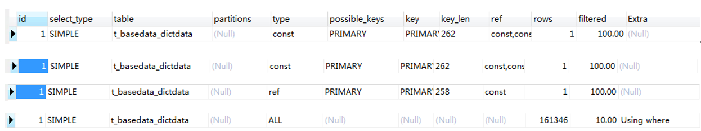

# 2020.09.02

#### 1.StringUtils判空

import org.apache.commons.lang.StringUtils

包必须手动导入，因为jdk自带的util包没有 isBlank() 方法。

1）boolean StringUtils.isEmpty(String str)  -》 str为 null 或 “” 为空

2）boolean StringUtils.isBlank(String str)  -》 str为 null 或 “”  或 “ ” 或 “   ” 或  “\n” 或 ” 或 "\t“ 都为空

具体：https://www.cnblogs.com/guiblog/p/7787569.html

#### 2.jpa的Entity层 与 数据库表

jpa的Entity层         数据库表    启动成功否           结论 

​    无@id                      任意             否                 程序只检查自己的语法，jpa必须要有主键，即使有相应的表

​    @id                          任意             是                 有主键就启动成功，mysql若没有表则建立

@id + @id                   任意             否                  程序只检查自己的语法，即使有相应的数据库表

@id+@id+@IdClass   任意             是                 正确，无论数据库表自己有几个主键

结论：实际中要一一对应，不要因为能启动成功就随意使用，以免后续的增删改查操作发生未知错误。

#### 3.Web

请求方式

1. 请求方式分为get、post等，get对应getMapping，post对应postMapping，不可混用

2. 传参分为两种：params  和  body

params

1. 可以由params传入，params可以是任意类型/对象。
2. 按照名字为 传递的参数 和 接受的参数 做对应
3. 默认，传参和入参随意，不必一一对应
4. 只有设置@ApiParams(require = true) 等注解时，才会规定入参必须需要那些穿参
5. 入参是对象时，在接受传参时，会调用同名set方法。
6. 入参是对象的字段和其他入参名同名时，两个都会赋值
7. body的列表从功能上说，也是params，而非body

body

1. body接受必须要有注解@Requestbody，这样才能认为是主体
2. 加入@Requestbody后，那么这一项就是必填的了
3. @Requestbody注解的都是对象必穿，但不表示其中的字段都必须有，要求比穿也需要require = true
4. 同样前后按名字对应，调用set方法
5. 传参可以是txt、xml、json等，但一般都是json

总结

1. 穿参和入参对应，get请求和@getMapping对应，参数和请求之间没有必然的关系

2. 但是一般用法主要有两种：

   第一种：get请求、@getMapping、params

   第二种：post请求、@postMapping、body(json)、@Requestbody

#### 4.注解：分层注解

基本注解

@Component  原意是组件，它是spring最基本的注解，作用是将类注入到bean中

MVC各层注解

@Controller 控制层注解，作用是@Component和表明他是控制层(后者好像没有实际意义)

@Service 服务层注解，作用是@Component和表明他是服务层(后者好像没有实际意义）

@Respository 持久层注解，作用是@Component和表明他是持久层(后者好像没有实际意义）

其他注解

@RestController 由@Controller和@ResponseBody组成，此外，ServiceComb


# 2020.09.03

#### 1.mysql

设置字段的默认值：alter table users_info alter column role_id set default 1

#### 2.注解：@Valided

@Valided 判空注解

问题引入：@ApiModelProperty(require = true)注解表明这个参数必填，即 param != null，否则服务无法调用

局限：对于基本类型它可以保证，但是对于String和对象它并不能完全确保有值。

解决：引入@Valided注解，以及连带的注解：

1. 控制层：

   类前：@Valided     

   函数参数前：@Valid

   ```java
   @RestController
   @Valided    
   public class StudentHandle {
   
       @PostMapping("/save")
       public Student save(@RequestBody @Valid SaveRequest param){
       }
   }
   ```

2. Model层

   @NotNull(massage="")		不能为 null

   @NotEmpty(massage="")    字符串不能为 null/""

   @NotBlank(massage="")     字符串不能为 null/""/空格/转移字符  

   @Size(min=1, massage="")  数组最小为1  

   @Valid             					   对象不能为空    

   

# 2020.09.04

#### 1.java和C++的字符串区别

1. java好像没有考虑过C++中 length(char*) 和 length(string) 的问题
2. 那么 java 的字符串和字符 的区别也是 \n 吗？

#### 2.mysql的varchar(1)

mysql的varchar(1)同时兼容java和C++中的char、char[]、string吗？

#### 3.jba注解之@Column

@Column(name="columnName", length=32) 

private String columnName;

可以直接映射到表中的字段，但是对于以经存在的字段，此句并不能更改varchar()的大小。

#### 4.jpa脱离数据库表的思想

jpa主张脱离表，如不使用sql语句，移植时不移植表。

1）建表：

1. jpa通过注解@Entity 建表、建立字段。
2. jpa通过注解@Column(name="columnName", length=32) 建立字段。
3. jpa通过注解@Id、@IdClass 建立主键、联合主键。

2）增删查改：脱离sql语句

3）设置字段属性：

​	字段默认值：代码实现，新增前固定给该字段赋值。

​	非空控制等：代码实现，代码自己判断。

4）表数据：

​	代码移植时：表如何移植

1. 表的数据存储在项目中，程序启动时自动初始化数据

 	2. 不给表设置多余的属性，依靠1）和3）保证

#### 5.时间戳

sql定义了三个类：Time   Date  Timestamp

```java
import org.junit.Test;

import java.sql.Time;
import java.sql.Date;
import java.sql.Timestamp;

public class Test2 {

    @Test
    public void fun1(){
        Date d = new Date(System.currentTimeMillis()); //获取当前日期
        System.out.println(d);                         //2020-09-04

        Time t = new Time(System.currentTimeMillis()); //获取当前时间
        System.out.println(t);                         //10:30:36

        Timestamp dt = new Timestamp(System.currentTimeMillis()); //获取当前日期时间
        System.out.println(dt);                                   //2020-09-04 10:30:36.219
    }
}
```

重点：jpa的字段 java.sql.Timestamp; 映射到mysql是datetime


# 2020.09.09

#### 1.mysql不等于

mysql中不等于 <>  和 != 都可以表示不等于，不过 <> 在所有的sql语句中都是通用的。


# 2020.09.14

#### 1.Linux: 查看文件内容

| 命令 | 解释                   | 常用                    | 解释             |
| ---- | ---------------------- | ----------------------- | ---------------- |
| cat  | 从第一行开始显示       | **cat filename**        | -n可以显示行号   |
| tac  | 从最后一行开始显示     |                         |                  |
| more | 一页一页的显示档案内容 |                         | d：向前翻页      |
| less | 相比more，可以翻页     | shift+g 移动到最后一行  | b：向后翻页      |
| head | 只看头几行             | head-n 20 filename      | 头10页，默认为10 |
| tail | 只看尾巴几行           | **tail -n 20 filename** | 尾10页，默认为10 |

#### 2.linux: cat

1. 命令格式：

   cat [选项] [文件]...

2. 命令功能：

   cat主要有三大功能：

   1. 一次显示整个文件: cat filename

   2. 从键盘创建一个文件: cat > filename 只能创建新文件,不能编辑已有文件.

   3. 将几个文件合并为一个文件: cat file1 file2 > file

3. 命令参数：

   -n, --number   对输出的所有行编号,由1开始对所有输出的行数编号

#### 3. grep 参数 "搜索条件" fileName

eg：grep -rn "getDictData.*7," servicelog.log

- 参数

  - -r ：进入目录搜索
  - -n :  显示行号

- 搜索条件：支持正则表达式

  - "getDictData" ： 搜索含有getDictData的

  - "getDictData.*7,"：搜索含有 getDictData和7，的

- fileName：文件，可以是文件，也可以是目录，注意目录要加 -r 


# 2020.09.17 

#### 1.Tyora：图片

绝对路径：直接粘贴，粘贴的就是绝对路径，但是这样的话，图片一经迁移就无法访问

相对路径：将图片和Tyora存放在同一个目录下，使用相对路径，图片和文件可以一起迁移

另外：Tyora也可以认为是文本标记语言，加标记可以使字体加粗、倾斜等。图片同样，加标记可以改变尺寸、背景等。


# 2020.09.25

#### 1.Specification：cb.and()

cb.and(predicate1, null)

cd.and：and毋庸置疑就是且，但是 predicate1 and null 结果是 predicate1 

cd.or：or毋庸置疑就是或，但是 predicate1 or null 结果是 null

综上所述，Specification认为null表示所有，而非一个没有

 

# 2020.10.10

#### 1.gitLab：Replace

在gitLab上更改内容

1. 选择要更改的文件
2. 选择 Replace
3. 导入更改的版本
4. merger两者


# 2020.10.13

#### 1.环境

| 缩写     | 全程                        | 中文                 |
| -------- | --------------------------- | -------------------- |
| DEV      | development                 | 开发                 |
| SIT      | System Integrate Test       | 系统整合测试（内测） |
| UAT      | User Acceptance Test        | 用户验收测试         |
| PET      | Performance Evaluation Test | 性能评估测试（压测） |
| SIM      | simulation                  | 仿真                 |
| PRD/PROD | production                  | 产品/正式/生产       |

四个主要环境：pro、pre、test、dev环境，中文名字：生产环境、灰度环境、测试环境、开发环境：

pro环境：生产环境，面向外部用户的环境，连接上互联网即可访问的正式环境。

pre环境：灰度环境，外部用户可以访问，但是服务器配置相对低，其它和生产一样。

test环境：测试环境，外部用户无法访问，专门给测试人员使用的，版本相对稳定。

dev环境：开发环境，外部用户无法访问，开发人员使用，版本变动很大。


# 2020.10.14

#### 1.断点调试


```java
@ControllerAdvice
public class MyExceptionHandler {

    @ExceptionHandler(value =Exception.class)
	public String exceptionHandler(Exception e){
		System.out.println("发生了一个异常"+e);
       	return e.getMessage();
    }
}

@ControllerAdvice
public class GlobalExceptionHandler {

    /**
     * 处理自定义异常
     *
     */
    @ExceptionHandler(value = DefinitionException.class)
    @ResponseBody
    public Result bizExceptionHandler(DefinitionException e) {
        return Result.defineError(e);
    }

    /**
     * 处理其他异常
     *
     */
    @ExceptionHandler(value = Exception.class)
    @ResponseBody
    public Result exceptionHandler( Exception e) {
        return Result.otherError(ErrorEnum.INTERNAL_SERVER_ERROR);
    }
}
```


# 2020.10.20

#### 1.win进程

- 通过端口号查看PID：netstat -aon|findstr "port"
- 通过PID查看信息：tasklist|findstr "PID"
- 通过PID杀死进程：taskkill /T /F /PID PID号

任务管理器方法：任务管理器：win10【详细信息】、win7【进程，如果没有PID字段，则查看->选择列->勾选PID】


# 2020.11.09

#### 1.Typora：分级目录

一级：实心圆；二级：空心圆；三级：实心正方形

快捷键：减号+空格


# 2020.11.11

#### 1. JPA：事务

```java
  @Modifying
  @Transactional
  @Query("delete from User u where u.active = false")
  void deleteInactiveUsers();
```

为什么@Modifying下一定要有@Transactional

- @Modifying的主要作用是声明执行的SQL语句是更新（增删改）操作，（仅仅只是声明）。
- @Transactional的主要作用是提供事务支持（JPA默认会依赖JDBC默认隔离级别，即默认只读，所以增删改需要此注解支持）。


#### 2. 注入值

##### 1. 配置文件版

```xml
<bean id="student" class="com.springIoc.entity.StudentEntity">
    <property name="id" value="1"></property>
    <property name="name" value="张三"></property>
    <property name="age" value="22"></property>
</bean>
```

#####  2. 注解+配置文件

@Component 代替 <bean id="student" class="com.springIoc.entity.StudentEntity"></bean>

@ConfigurationProperties(prefix = "student")

```properties
student.id=1
student.name="张三"
student.age=22
```


##### 3. 注解

```java
//@Value("${person.last-name}")
private String lastName;
//@Value("#{11*2}")
private Integer age;
//@Value("true")
private Boolean boss;
```


# 2020.11.16

#### 1. Ajax

网页异步刷新：Web2.0和核心，Ajax的核心


# 2020.11.25

#### 1. springMVC：传map

#### 2. 新生代、老年代

#### 3. k8s上linux命令：jmap、grep


# 2020.12.02

#### 1. vi：查看

1）上下翻动：向上箭头、向下箭头：每次滚动一条日志，这条日这可能占据多行

2）前后翻页：ctrl+f、ctrl+b：f就是forword，b就是backward

3）首行末行：首行（gg），末行（shift+g）

4）查找：?string：查找字符串，N向前，n向后

5）分页分屏：k8s中的vi也支持分页/分屏操作


# 编译打包运行：

### 1. 单jar包

例子：创建一个java项目，编写两个类Welcome.java和Teacher.java，其中类Welcome含有main函数，是程序的入口，并调用Teacher中的greeting。

```java
package com.sunpeng;
import com.sunpeng.impl.Teacher;
public class Welcome {
    public static void main(String[] args) {
        Teacher.greeting();
    }
}
```

```java
package com.sunpeng.impl;
public class Teacher {
    public static void greeting(){
        System.out.printf("Welcome study jar!");
    }
}
```

命令在src目录下运行

#### 1.1 编译

|        | 编译                                                         |
| ------ | ------------------------------------------------------------ |
| JVM    | javac com/sunpeng/Welcome.java           编译Welcome时因导入Teacher，所以Teacher并不需要再执行编译命令 |
| idea   | Build                                                        |
| maven  | mvn package                              同时编译打包        |
| gradle | gradle package                           同时编译打包        |

#### 1.2 打包

|        | 编译                                                         |
| ------ | ------------------------------------------------------------ |
| JVM    | 1）jar -cvfm welcome.jar META-INF/MANIFEST.MF com/sunpeng/Welcome.class com/sunpeng/impl/Teacher.class |
| idea   | 2）将需要打包的文件放到target中，然后 jar -cvfm welcome.jar META-INF/MANIFEST.MF * |
| maven  | mvn package                同时编译打包                      |
| gradle | gradle package             同时编译打包                      |

```java
#/MANIFEST.MF文件
Manifest-Version: 1.0
Created-By: 1.8.0_231 (Oracle Corporation)
Main-Class: com.sunpeng.Welcome
```

#### 1.3 运行

|        | 编译                                                         |
| ------ | ------------------------------------------------------------ |
| JVM    | (1) 运行字节码文件：java Welcome     (2) 运行jar文件：java -jar welcome.jar |
| idea   | Run                                                          |
| maven  | java -jar welcome.jar                                        |
| gradle | java -jar welcome.jar                                        |

### 2. 调用jar

例子：模块一：创建一个java项目，编写Teacher.java，含有方法greeting。模块二：创建一个java模块，编写Welcome.java，含有main函数，并调用模块一Teacher中的greeting。

#### 2.1 Teacher编译打包

和第一节的方法一样

|        | 编译                                                         |
| ------ | ------------------------------------------------------------ |
| JVM    | (1) 编译 javac com/sunpeng/Welcome.java    (2) 打包 jar -cvf com/sunpeng/impl/Teacher.class |
| idea   | (1) 编译build  (2)打包 jar -cvf com/sunpeng/impl/Teacher.class |
| maven  | mvn package                同时编译打包                      |
| gradle | gradle package             同时编译打包                      |

#### 2.2 编写/识别

welcome识别teacher.jar，实际编写代码时并不需要识别，只需要在编译运行时指明jar包路径即可

|        | 编译                                                         |
| ------ | ------------------------------------------------------------ |
| JVM    | 普通编译器根本没有识别功能                                   |
| idea   | jar包右键-->add a library  ，如果不识别idea就会报错，就没有链接提醒 |
| maven  | mvn install 导入仓库中，再在Welcome中加入依赖                |
| gradle | 待补充                                                       |

```xml
<dependency>
    <groupId>com.sunpeng</groupId>
    <artifactId>teacher</artifactId>
    <version>1.0-SNAPSHOT</version>
</dependency>
```

#### 2.3 编译、打包、运行

|      | JVM                                                          |
| ---- | ------------------------------------------------------------ |
| 编译 | javac -cp ..\lib\teacher.jar com\sunpeng\Welcome.java -d ..\target |
| 打包 | jar -cvfm welcome.jar META-INF/MANIFEST.MF *     MANIFEST.MF文件需要添加Class-Path |
| 运行 | java -jar welcome.jar                                        |

```java
#/MANIFEST.MF文件
Manifest-Version: 1.0
Created-By: 1.8.0_231 (Oracle Corporation)
Main-Class: com.sunpeng.Welcome
Class-Path: ../lib/teacher.jar
```

### 3. 细节补充

#### 3.1 编译

在Terminal中执行javac命令，具体：

javac com/sunpeng/Welcome.java

- 之需要显示地编译Welcome.java即可，因为在导包时会编译Teacher：import com.sunpeng.impl.Teacher;
- 必须在src目录下执行，因为系统不仅会编译Welcome，也要编译Teacher，所以必须找到Teacher。Teacher导入的路径为：import com.sunpeng.impl.Teacher; com目录在src下，所以必须是src。

#### 3.2 打包

jar -cvf com/sunpeng/Welcome.class com/sunpeng/impl/Teacher.class

打包并生成META-INF/MANIFEST.MF文件，如下

```java
Manifest-Version: 1.0
Created-By: 1.8.0_231 (Oracle Corporation)
```

但是生成的META-INF/MANIFEST.MF也并不知道程序入口，需要添加：

```java
Main-Class: com.sunpeng.Welcome
```

将Welcome和Teacher放到一起，并指明程序的入口

然后执行：

jar -cvfm welcome.jar META-INF/MANIFEST.MF com/sunpeng/Welcome.class com/sunpeng/impl/Teacher.class

- -c 表示要创建一个新的jar包，
- -v 表示创建的过程中在控制台输出创建过程的一些信息，
- -f 表示给生成的jar包命名
- -m 表示要定义MANIFEST文件。之后再重新执行

#### 3.3 编译打包

步骤：

1. 新建target

2. javac com/sunpeng/Welcome -d ../target

3. 将META-INF/MANIFEST.MF复制到target中

4. 进入target目录
5. jar -cvfm welcome.jar META-INF/MANIFEST.MF

此外，可以在命令行确定main函数入口

java -cp welcome.jar com.sunpeng.Welcome

cp表示classpath，后面跟main函数的路径

#### 3.4 查看jar文件目录

jar -tf filename.jar


# 2020.12.18

#### 1.动态打印日志：tailf

tailf  filename


# 2020.12.22

#### 1. 接口基本类型包装成对象不？

```java
public class Person {
    private boolean bool;
    private Boolean objectBool;
}
```

- Person person = new Person();
  - boolean 默认值为 false
  - Boolean 为 null

- 但如果在 Person person 在接口中

  ```java
  @RestController
  public class MyController {
      public void queryPerson(Person person);
  }
  ```

  - Boolean：此时候Boolean可以接受原本可能的传参

    传参：空、null、false、"false"、“”、“ ”      --> 接收：false

    传参：true、”true“  --> 接受：true

    传参：”abc“  --> 参数出错

  - boolean：待验证


# 2020.12.23

#### 1. 课堂记录

1. 项目框架

2. git\sourcetree\gitee

   git@gitee.com:cpf100/msb-dongbao-mall.git

3. mysql和duck

4. lombok与代码生成器与mybatis-plu


# 2020.12.25

#### 1.虚拟机安装

- VMware：好像需要破解
- VirtualBox6.3：好像开源，Oracle的，官网下载

#### 2.linux安装

- CentOS-8.0：好像开源，下载地址：http://mirrors.163.com/【网易镜像地址】

  安装：

  - 虚拟机新建操作系统： 新建操作系统 -》设置内存、存储。
  - 加载：选择要加载的镜像 -》加载
  - 操作系统配置：选择存储、root用户设置 -》重启
  - 个性化设置：等等。
  - 网络设置：1.网络设置； 2.网络配置文件修改

#### 3.docker安装

##### 3.1 docker安装

```sh
yum install -y yum-utils device-mapper-persistent-data lvm2 wget
wget -O /etc/yum.repos.d/docker-ce.repo https://download.docker.com/linux/centos/docker-ce.repo
sed -i 's+download.docker.com+mirrors.tuna.tsinghua.edu.cn/docker-ce+' /etc/yum.repos.d/docker-ce.repo
yum -y makecache fast
yum -y install docker-ce-18.09.9
```

##### 3.2 docker启动

```sh
#启动停止虚拟机命令
systemctl start docker
systemctl enable docker
systemctl stop docker

#关闭防火墙
service firewalld status #查看防火墙状态
service firewalld stop #关闭防火墙
```

#### 4.docker容器

##### 4.1.docker配置阿里镜像

- 获取阿里云的容器配置

  - 登录阿里云：https://cr.console.aliyun.com/cn-hangzhou/instances

  - 获取阿里云在docker中配置文件：

    ```json
    {
      "registry-mirrors": ["https://h45068lf.mirror.aliyuncs.com"]
    }
    ```

- 在虚拟集中配置

  - /etc/docker/daemon.json

    ```json
    {
      "registry-mirrors": ["https://h45068lf.mirror.aliyuncs.com"]
    }
    ```

    或者直接执行

    ```sh
    tee /etc/docker/daemon.json <<-'EOF'
    {
      "registry-mirrors": ["https://registry.docker-cn.com"]
    }d
    EOF
    ```
  
  - 重启docker
  
    sudo systemctl daemon-reload
    sudo systemctl restart docker

##### 4.2 拉去镜像

```sh
docker search 关键字 #查询可以镜像 eg：docker search mysql
docker pull 镜像名:tag   #拉取镜像 eg：docker pull mysql:5.7
docker images  #查看所有本地镜像
docker rmi id #删除指定的本地镜像
```

##### 4.3 启动容器

```sh
#创建容器
docker run -d --name mytomcat -p 8888:8080 tomcat #新建并启动容器
docker ps #查询容器
docker rm  容器名或id #删除容器
#启动容器
docker start  容器名或id #开启容器
docker ps -a #查询正在运行的容器
docker stop  容器名或id #关闭容器
docker restart  容器名或id #重启容器
#修改容器配置
docker exec -it 容器名或id bash #进入容器
exit #退出
```


# 2020.12.30

#### 1. centos测速

```sh
#安装git
yum -y install git
#git克隆speedtest
git clone https://github.com/sivel/speedtest-cli.git
#进入speedtest-cli
cd speedtest-cli
#修改speedtest.py，由于现在一般python都是python3，所以#!/usr/bin/env python -》 #!/usr/bin/env python3
vi speedtest.py
#执行speedtest-cli
./speedtest-cli
```

可能报错：./speedtest-cli执行失败，没有python

```sh
#检查python版本
python -version
python3 -version
#安装python3
dnf install python3
```

设置全局

```sh
#增加读写执行权限及移动到全局操作目录
chmod +rx speedtest.py
sudo mv speedtest.py /usr/local/bin/speedtest-cli
sudo chown root:root /usr/local/bin/speedtest-cli
speedtest.py #任意位置执行
```


# 2020.12.31

#### 1. maven

- maven 程序、配置文件(setting.xml)、仓库(repository) 互不相关
- maven 配置环境变量，但不知道是不是一定要配置
- idea工程后的setting只对此工程起作用，要想全部工程生效需要在启动页面上设置Configure
- 工程类型
  - POM工程：父级工程，子model集成，用作jar包的版本控制
  - JAR工程：常用于本地工程的调用
  - WAR工程：发布到服务器上的工程


#### 2. linxu命令

```sh
ip addr #查询ip
ifconfig  #查询ip
uname -v #查询虚拟机内核版本
ps -ef    #查询进程
jmap -heap pid   #查询堆内存
```


# 2020.1.04

#### 1. 联合主键索引

t_basedata_dictdata (PK: bd_type, bd_code)

```sql
explain select * from t_basedata_dictdata where bd_code = 1010000 and bd_type = 2;
explain select * from t_basedata_dictdata where bd_type = 2 and bd_code = 1010000;
explain select * from t_basedata_dictdata where bd_code = 1010000;
explain select * from t_basedata_dictdata where bd_type = 2;
```




# 2020.1.15

#### 1.坑0

- 场景
  - aliyunCode字段 数据库中 不能为空
  - aliyunCode字段 接口中 不是必传， 
  - template 和mapper两个表关联

- 结果
  - 每次必须判断aliyunCode为不为空，为空要么不增，要么给默认值
  - 两张表结合导致 复杂度 指数上升
  - 导致3个bug：都是因为数据库为空

- 补充：如果就是这种场景应用，记得，不但需要入参的aliyunCode为不为空，还需要判断数据库中查询大的结果是否为空


#### 2.工作总结

- 全文替换

- 流的使用
- 单元测试


# 2021.01.16

#### 1. postman

账户：476567162@qq.com

密码：sp602157


# 20.01.28

#### 1、IDEA自带maven的settings.xml位置

IDEA自带maven的settings.xml文件的位置：D:\IntelliJ IDEA 2018.3.6\plugins\maven\lib\maven3\conf


#### 2、mysql表的字段与mysql关键字重名

坑：使用Navicat Premium图形化界面建表，没有用mysql语句建表，使得即使重名也能建表成功。

导致：后面再使用Navicat Premium操作表，如增删行不会，不会报错，

但是，使用mysql语句插入，会报错，但由于mysql语句时自己当场写的，这个错还很直接，查看mysql语句总会发现。

但是，使用springboot和jpa和mysql框架时：根本找不到错误再哪里？控制台会报sql语句出错，但这样完全不直观，根本想不通sql哪里出错了。


#### 3. gradle安装

##### 3.1 下载

地址：https://services.gradle.org/distributions/  -> gradle-4.5-bin.zip

- gradle-x.x-bin.zip  发行版

- gradle-x.x-src.zip　源码

- gradle-x.x-all.zip   全部文件(发行版+源码)

##### 3.2 环境配置

我的电脑-属性- 高级系统设置-环境变量

（1）新建 -》变量名{GRADLE_HOME}，变量值{D:\gradle4.5\gradle-4.5}

（2）path -> 编辑 -》 新建 -》{%GRADLE_HOME%\bin}

##### 3.3 测试

命令提示行

命令：gradle -v 

结果：显示有Gradle 4.5


#### 4、groovy语言

##### 4.1 没有类也没有main

代码直接写直接执行

##### 4.2 换行已换行符做标志

groovy句末不需要“;”,估计是以换行符作为结尾标志。那么长语句需要换行是时就需要注意。

```groovy
println("hello grovvy");
println("hello grovvy")
println"hello grovvy" //甚至不需要”()“
```

##### 4.3 集合的添删查改

```groovy
list<<'c' //增
```

##### 4.4 groovy是弱类型语言

def i =18 

def s = "ximing"

def list = ['a','b']

def map = ['key1':'value1','key2':'value2']

##### 4.5 函数名与函数指针类型

- 函数指针：作用是当作变量传入使用

- 函数名：作用就是函数调用，即()

- C/C++：函数名等于函数指针

- groovy：函数名单单就是函数名，而函数指针可能即使函数指针，也是函数名

```groovy
def b1 = {               //1. b1挺像C语言的函数指针，method的参数用的就是函数指针
	println("hello b1")
}

def method(){                 //2. 正经函数没有什么好说的
	println("hello method")
}

def method1(Closure c){  //3. method1也是正经函数，不过他的形参是函数指针。函数指针的类型名是Closure。
	c();                 //4. 参数c是函数指针，所以可以用c()方法
}

b2()                        //5. 直接调用b2();  可以执行，输出hello b1
method()                  //6. 直接调用method() ；可以执行，输出hello method     
method1(b1)           //7. 调用method1，参数传入b1。可以执行，输出为hello b1
method1(method)      //8. 调用method1，参数传入method。不可以执行。

//函数指针的参数传入
def b2 = {
v1 ->                      //函数指针的参数。
	println("hello b2 ${v1}")
}

def method2(Closure c) {
	c("mmm");
}
method2(b2)
```


#### 5、数组

##### 5.1 java与C++的区别

| 数组   | C++                                   | java                                              |
| ------ | ------------------------------------- | ------------------------------------------------- |
| 定义   | 内置，本质是一个不能改变指向的指针    | 对象，对C中数组封装而来                           |
| 初始化 | int  arr[] = {1,2,3};                 | int[] arr = {1,2,3} == new int{1,2,3};  本质是new |
| 赋值   | arr1 = arr2; 错误，数组名不能改变指向 | arr1 = arr2; 可以，java可以随便指                 |
| 多维数 | 每一维的长度必须一样                  | 每一维的长度可以不一样                            |

##### 5.2 初始化

初始化:

静态初始化：int[] arr=new int[]{1,2,3,4}   化简为 int[] arr={1,2,3,4}   

动态初始化：int[] arr=new int[5]; 整形的系统默认值为0，浮点为0.0，字符是'\0'，引用类型为NULL

```java
int[]  ar = new ar[num];
int[][]  arr=new  arr[numI][];
int[][][] arrr =new arrr[numI]numJ[][];
/*
上述的定义初始化都是合法的，以arr为例子，只需要给出第一维的大小就可以定义，让编译器知道在堆上开辟几个int[]即可，其他维可以后面再初始化，但要修改具体元素时全部维度都必须定义完成。
*/
```

##### 5.2 Arrays

```java
//工具Arrays：扩展数组的功能，里面全是静态函数
int[] arr = {1,2,3};
Arrays.tostring(arr)               //配合打印使用
Arrays.sort(arr)                   //排序
Arrays.binarySearch(arr,value)     //输出pos
Arrays.copyOf(arr,length)          //完整复制
Arrays.copyOfRange(arr, left, right)  //区间复制，左闭右开
Arrays.equals(arr,arr2)               //判断数组内的值相等不，补足==
Arrays.fill(arr,value)                //数组全部填充为value
    
//系统复制(源，源的起始位置， 目标数组， 目标数组的起始位置， 需要复制的长度)；
System.arraycopy(src, srcsPos,  des, desPos, length);
```


#### 6、继承

##### 6.1 java与C++的区别

| 特性             | java                                                    | C++                                         |
| ---------------- | ------------------------------------------------------- | ------------------------------------------- |
| 对象的内存       | People p1 = new People(); 始终在堆中                    | 栈People p1;   堆People *p1 = new People(); |
| 继承关键字       | extends                                                 | :                                           |
| 继承权限         | public                                                  | public、private、protected                  |
| 多重继承         | 单继承、多实现                                          | 支持，且可能会有菱形继承                    |
| 派生类中访问基类 | 关键字：super                                           | 作用域：类名::                              |
| 构造器调用构造器 | 一般用this，继承中用super                               | 继承中用初始化列表                          |
| 多态             | Base b = new Derive(); （java没指针但估计也是指针实现） | Base  *p = new Derive();                    |


##### 6.2 C++多天实现

Base b = new Derive();

1. b有实无名，即"名"(类型)是基类，"实"(内存)是子类。
2. 那么如果子类的方法或字段中存在public，b能不能访问子类的变量呢？答案是不能，即使实际存在，不知道叫什么，自然也无法访问。
3. "有实"却无法访问，那有没有"实"又有什么用呢？答案覆盖（基类和子类的同函数名、同参数、兼容返回值的成员方法）和多态（表现为同一个入口却调用不同的方法）。
4. 编译时，对象在调用成员方法时，编译器会查看对象的内存，调用覆盖的子类方法，当然非覆盖方法它还是调用不了，就和（3）一样。
5. 如果子类中有一方法继承自基类，同时它还调用了非继承的方法，那么这是不是就间接钻篓了？答案是允许合法。
6. 通过（5）可以访问到非继承的，但还可以通过强制类型转换访问，如 ((Derive)b).方法。


#### 7、String

```java
//new对象
String str1 = "hello";
String str3 = new String("hello");  
char[] c = {'h','e','l','l','o'};
String str5 = new String(c);
String str6 = new String(c,0,2);

//改变指向
s = "hello2"; //改变执行
s += "world"; //内在是改变了指向，外在表现是尾增

//增删查改，内存不可变，无法增删
s += "world"; //外在表现是尾增，内在是改变了指向
s.replace('value1','value2'); //改：把String元素中的1替换成2
s.chatAt(pos) //查：根据位置查值
s.indesOf(values) //查：根据值查询位置，没有返回-1
	
//判断相等
equalsIgnoreCase() //通过内容且忽视大小写
//字符串分割: split
String s = "hello world sun peng";
String[] strs = s.split(" ");
	
//可变字符串StringBuffer
s.append("")  //增
s.insert(pos, 任意类型值)   //插入
delete(leftPos, rightPos) //删：从left删到right,左闭右开
```

#### 8、IO

##### 8.1 Scanner

```java
import java.util.Scanner;      
Scanner sc = new Scanner(System.in);
int age = sc.nextInt();   //整形
String name = sc.next();  //字符串
char sex = sc.next().charAt(0); //字符型
```

- 与C++一样，space和enter都表示结束
- UTF8编码：字符占俩个字节，有汉字编码，'\0'是字符第0个

##### 8.2 file

打开关闭

```java
File f = new File("sp1.txt");
boolean  f.exists() //判断是否打开成功
boolean  f.delete() //删除
boolean  f.isDirectory() //判断是否是目录文件/文件夹
boolean  f.isFile()  //判断是否是文件
```

读写

| IO                                                       | 读写                                                         | 备注                                                         |
| -------------------------------------------------------- | ------------------------------------------------------------ | ------------------------------------------------------------ |
| FileReader  in = new FileReader("file");                 | int  read(); int是读到的数  int  read(char[] buffer) int是读到的个数   -1表示没读到 | int  read(); 返回值是int类型，表示读到的数。  但是reader还是按照char大小读，  inputStream还是按照byte大小读。 |
| FileWriter  out = new FileWriter("file");                | int  write(int c);    int  write(char[] buffer)  int  write(string buffer) |                                                              |
| BufferedReader  br = new BufferedReader(FileReader in);  | int  read();  int read(char[] buffer)   string readline();   | int  read();同理                                             |
| BufferedWriter  bw = new BufferedWriter(FileWriter out); | int  write(int c);    int  write(char[] buffer)  int  write(string buffer) | bw.newLine()  bw.flush()                                     |

FilterInputStream\ FilterOutputStream \BufferedInputStream\BufferedOutputStream按照Byte读取


#### 9、集合

##### 9.1 结构

- Collection    

  - set

    **HashSet** 两者之间

  - list

    - **LinkedList** 改快读慢

    - **ArrayList** 读快改慢

  - Vector
    
  - **Stack**
    
  - Queue
    
    - **LinkedList**

- Map

  - **HashMap**

  - **TreeMap**

##### 9.2 增删查改

| 操作 | set                                      | list                                             | Map                                                          | Stack(Stack是实现类) | Queue(Queue是接口，实现类是LinkendList)                      |
| ---- | ---------------------------------------- | ------------------------------------------------ | ------------------------------------------------------------ | -------------------- | ------------------------------------------------------------ |
| 增   | boolean add(E e)                         | boolean  add(E e)  void  add(int index, E e)     | Object  put(Object key, Object value)  如果key已存在，则返回被替换掉的元素  void  putAll(Map t); | E  push(E item);     | boolean  add(E e);  **boolean offer(E e);**队列为空返回null  在队头插入 |
| 删   | boolean  remove(Object o)  void  clear() | boolean  remove(Object o)  void  clear()         | Object  remove(Object key);  void  clear()                   | E  pop();            | E remove();   **E poll();** 队列为空返回null  获取并删除队头 |
| 查   | boolean  contains(Object o)              | E  get(int index)  boolean  contains(Object o)   | Object  get(Object key);  boolean  containsKey(Object key);  boolean  containsValue(Object value); | E  peek();           | E  element();  **E peek()**; 队列为空返回null  获取但不移除队头 |
| 改   |                                          | E  set(int index, E element)  返回被替换掉的元素 | Object  put(Object key, Object value)  如果key已存在，则返回被替换掉的元素 |                      |                                                              |
| 判空 | boolean  isEmpty()                       | boolean  isEmpty()                               | boolean  isEmpty()                                           | boolean  empty()     | boolean  isEmpty()                                           |
| 大小 | int  size();                             | int  size();                                     | int  size();                                                 |                      |                                                              |

##### 9.3 遍历Iterator

```java
public void fun1(Collection c) {
    Iterator i = c.iterator();       //1、定义迭代器，初始位置为-1
    while (i.hasNext()){          //2.（p+1） == null 判断有没有下一个
    if(i.next().equals("aaa")){   //3.p++并返回*p，先++指向下一个，然后在解引用
        i.remove();             //4.删除
      }
    }                          //总结：核心原因是初始为-1，如此循环的思想就是需要的时候再给
}
```

- 当程序中有两个i.next()时,会有两次++，程序每一循环都是+2，后一个就和前一个不一样，后一个也需要先判断是否越界，i.hasNext()，所以只是为了*p的使用，那么先要给出Object o = i.next(); 然后就可以反复使用o，而不用担心多次++

##### 9.4 常用算法Collections  

Collections中的算法只对List实现，因为List是有序的数据结构，且都是静态方法。


# 2021.02.01

#### 1、ps -ef | grep java

部署完查看部署的配置：ps -ef | grep java， 如堆内存占比

#### 2、非堆成加密

**非堆成加密**：生成私钥和公钥，传输时消息和公钥可能会被截取。

| 加密/签名    | 解密/验签    | 泄露                         | 篡改                             |
| ------------ | ------------ | ---------------------------- | -------------------------------- |
| **公钥加密** | **私钥解密** | 防泄露，因为只有私钥才能解密 | 能篡改，因为公钥就可以为信息加密 |
| **私钥签名** | **公钥验签** | 会泄露，因为公钥就可以验签   | 防篡改，因为只有私钥才能签名     |

- 如果既要防泄露又要防篡改，需要双方都生成公私钥，消息在通信时既要加密又要签名。
- 非堆成加密：RSA加密算法

参考：https://www.cnblogs.com/pcheng/p/9629621.html


# 2021.02.23

-  mstp

  - http://接口域名/mstp/message/v2/push  --> 消息推送接口

  - http://接口域名/mstp/message/v2/batchPush  --> 根据channelId/tag进行批量消息推送

  - http://接口域名/mstp/notification/v2/push

  - http://接口域名/mstp/notification/v2/batchPush

    

- message调用mstp
  - pushMessage
    - 普通推送 --》 push  
    - 广播 --》batchPush(chenneId=(etc配置)bizmate.tid)
  - pushNotification


# 2021.03.18

- 启动类：idea和gradle都可以启动gvm，用哪个自己选择，公司本地启动使用idea
- runWith：启动前执行一个gradle小程序，把gradle文件生成为application.properties
- 打tar包：公司代码也可以打包，执行，生成的文件中含有application.properties，其他环境会直接覆盖这个文件。
- base组件：（1）可以在服务启动时做点什么，只需要继承一个接口.（2）日志级别设置；（3）敏感字段加密：一个类的to/from方法。


# 2021.03.20

1、异常处理

```java
try {
    response = Jsoup
            .connect(url)
            .timeout(60 * 1000)
            .method(method)
            .header("Content-Type", ContentType.APPLICATION_FORM_URLENCODED.toString())
            .header("Accept", ContentType.APPLICATION_JSON.toString())
            .data(map)
            .followRedirects(true)
            .ignoreContentType(true)
            .execute();
    System.out.println(response.body());
} catch (IOException e) {
    Logger.error("http error", e)
}
```

1.1 打印堆栈

- Logger.error("http error", e) 中的e打印的就是堆栈，且先打印堆栈，再打印自己的描述信息

- Logger.error("http error", e) 中的e没用，打印堆栈就是帮助定位信息，描述信息已经很清晰地定位到信息了

- 那么会不会不清楚try{}中哪一行的错误？不会。因为IOException只会捕捉IOException，不过异常类型不明确的话另说。

- java或框架的自动异常处理（打印堆栈）

  - 打印堆栈是为了帮助定位错误，用于不发预见的执行时异常

  - 检查异常需要自己处理，打印时我觉得就没必要打印堆栈了，直接打印描述信息不香吗

  - 至于检查异常在自己没有打印堆栈时，仍打印堆栈，这都是因为后面的代码要用到，但是前面的已经异常了，没有生产出数据，还使用的话就空指针了

  - springboot统一异常处理会捕捉异常（实现一个接口就行），这样代码就不会再往下执行，也就不会再打印堆栈了。

  - serviceComb框架内会先于springboot统一异常处理，处理异常，所以，一有异常serviceComb就会打印异常堆栈，往往把正常的业务情况打印出来，建议关掉。

    

    

    

# 2021.03.24

#### 1、时区

token更新时，本地和数据库时区不一样

数据库配置，设定时区

#### 2、jsoup

.data(map) 中map的值不能为空

解决：

注解：@JsonInclude(JsonInclude.Include.NON_NULL)

可以在 new ObjectMapper().convertValue(object, Map.class)时，不将object中的空转换

#### 3、string和list<>之间的转换

String strList = objectMapper.writeValueAsString(arrayList);

List<Student> students = objectMapper.readValue(listJsonStr, new TypeReference<List<Student>>()

#### 4、重名

尽量防止重名，

注入失败


# 2021.03.25

#### 1、mysql 根据条件删除数据

```sql
#查询
select * from t_basedata_dictdata where bd_type=6 and parent_bd_code=-1 and bd_code not in (select bd_code from t_basedata_dictdata where bd_type=7 and parent_bd_code=-1)

#删除
Delete from t_basedata_dictdata where bd_type=6 and parent_bd_code=-1 and bd_code not in (select bd_code from (select bd_code from t_basedata_dictdata where bd_type=7 and parent_bd_code=-1) bc)
```

删除的不同点，多包装了一层

(select bd_code from (select bd_code from t_basedata_dictdata where bd_type=7 and parent_bd_code=-1) bc)

将查询到的bd_code重命名为bc，然后再查询。但不明白为社么这么做


#### 2、token错误

- 情景1：时区不同，本地和dev的时区不一样，导致token的过期时间

- 情景2：数据库不同，dev和sit环境数据库不同，导致token错误

  强制删除接口


# 2021.03.26

#### 1、http访问

get/post/put/delete

exchange/getForEntity/postForEntity


# 2021.04.02

#### 1、springboot配置

```java
public class myConfig{
    private String name;
    
	@Value("${supplier-access.nmyvirtual}")
	private String hobby;
}

@ConfigurationProperties(prefix = "supplier-access.nmyvirtual") //正确
@ConfigurationProperties(prefix = "supplier-access.nmyVirtual") //错误  
```

```properties
supplier-access.nmyvirtual.name=sunpeng   //可以不配置
supplier-access.nmyvirtual.hobby=women    //必须配置 
```

- @ConfigurationProperties中不能出现大小字母

- @Value必须配置，不然就会启动失败

  

#### 2、异常：类找不到

- ClassNotfoundException 编译时找不到类（常见）
  - 注入时的，找不到配置，找不到配置等等。

- NoClassDefFoundError 运行时找不到类（不常见）
  - 一种情况就是因为静态变量加载不到原因
  - 工程里没有将jar添加到classpath，maven项目的，需要根据项目情况排查


# 2021.04.14

1、restTemplate

1.1 返回类型

```java
//确定类型
Class<T> clazz;
ResponseEntity<T> = restTemplate(url, clazz);
//可以传入object, object[]

//不确定类型
ResponseEntity<Object> = restTemplate(url, Object.class);
```


# 2021.04.16

#### 1、postman

1.1 切换环境实现不同环境下的测试

- 切换环境达到不同环境
- 在请求中通过变量{{supplier-access}}达到不同服务

图1：不同环境


图2：不同服务


图3：不同接口


#### 2、日记账 Journal

#### sp4

##### 凭证

新增凭证         增加辅助核算项信息

查询凭证          增加辅助核算项信息

修改凭证           Voucher

删除凭证           Voucher


新增科目           AccountSubject

- 测试，注意没有传 null 或 ""

查询科目           AccountSubject

- 测试，新增字段

获取科目code规则

##### 账套

获取辅助核算项列表    AssistingAccounting

- assisting_name 七种、汉字
- show_detail 非必传、true/false

获取币种列表

获取期间列表

##### 日记账

查询日记账内部转账  Transfer

创建日记账内部转账  Transfer

- 转入账户、转出账户、时间、摘要、金额


#### sp5

修改日记账收支                 Journal

删除日记账收支                 Journal

修改日记账内部转账  Transfer

新增日记账内部转账  Transfer

获取供应商配置 supplier（supplierId，启停时间，用户token）

- supplierId long-->string
- 用户token：拆分、非必传


供应商接入

- 供应商信息：（已完成）

  - 删除supplierEnum，调用供应商管理

- 不校验供应商状态（已完成）

  - 删除supplierStatusEnum

- 获取供应商配置

  - 获取供应商配置接口迁移到供应商管理

  - etc页面地址迁移到供应商管理的json文本

- 柠檬云生产环境
  - id和密码
  - k8s配置柠檬云生产域名


供应商管理

- 供应商信息（已完成）
- 获取供应商配置
- 供应商id由long转换成String 
- 柠檬云生产环境
  - 移动端url


